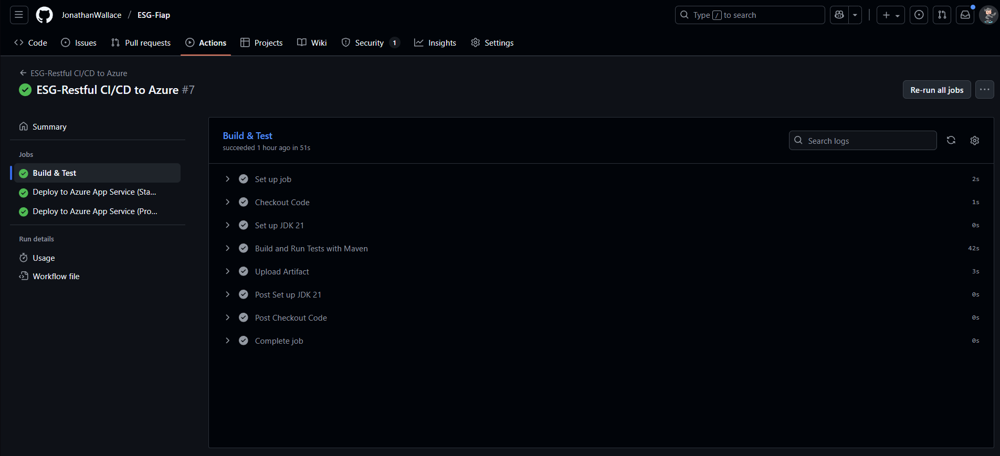
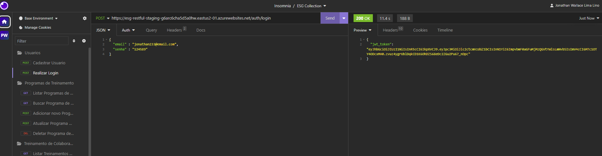
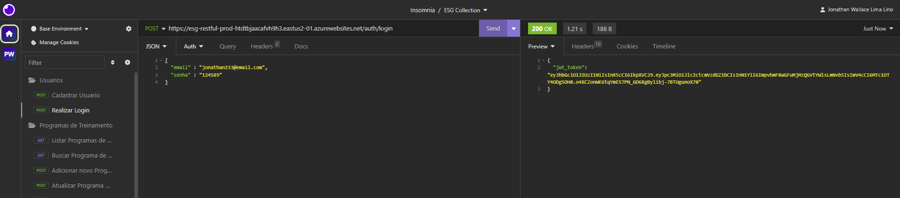

# ESG Restful

API RESTful desenvolvida para um programa de treinamento e análise de diversidade e inclusão de empresas. A aplicação permite o gerenciamento e consulta de dados de colaboradores, treinamentos e métricas de D&I (Diversidade & Inclusão), alinhados às práticas de ESG (Environmental, Social, and Governance).

Este projeto foi construído utilizando as melhores práticas de desenvolvimento, incluindo um pipeline de CI/CD totalmente automatizado, containerização com Docker e configuração externalizada para múltiplos ambientes.

---

## 🚀 Como executar localmente com Docker (a partir de um arquivo .zip)

Para executar a aplicação em seu ambiente de desenvolvimento, siga os passos abaixo.

### Pré-requisitos
*   [Docker Desktop](https://www.docker.com/products/docker-desktop/) instalado e em execução.

### Passos

1.  **Descompacte o projeto:**
    Extraia o conteúdo do arquivo `.zip` que você recebeu para uma pasta de sua preferência no seu computador.

2.  **Navegue até a pasta do projeto:**
    Abra um terminal (PowerShell, CMD, ou o terminal do seu sistema operacional) e navegue até a pasta que foi criada no passo anterior.
    ```bash
    # Exemplo:
    cd C:\Caminho\Para\O\Projeto\esg-restful
    ```

3.  **Configure as variáveis de ambiente:**
    Este é o passo mais importante para conectar a aplicação ao banco de dados. Abra o arquivo `docker-compose.yml` em um editor de texto. Na seção `environment`, preencha os valores para as credenciais do banco de dados e o segredo do JWT:
    ```yaml
    environment:
      - SPRING_DATASOURCE_URL=jdbc:oracle:thin:@oracle.fiap.com.br:1521:ORCL
      - SPRING_DATASOURCE_USERNAME=SEU_USUARIO_AQUI
      - SPRING_DATASOURCE_PASSWORD=SUA_SENHA_AQUI
      - JWT_SECRET=seu-segredo-super-secreto-para-desenvolvimento
    ```

4.  **Suba a aplicação com Docker Compose:**
    No terminal, dentro da pasta do projeto, execute o seguinte comando:
    ```bash
    docker-compose up --build
    ```
    Este comando irá construir a imagem Docker da aplicação (usando o `Dockerfile`) e iniciar o container.

5.  **Verifique se a aplicação está no ar:**
    Após o log indicar que o Spring Boot iniciou, acesse a URL `http://localhost:8080/` no seu navegador ou Postman. Você deverá receber a seguinte mensagem:
    ```
    Aplicação ESG Restful está no ar!
    ```

---

## ⚙️ Pipeline CI/CD

O projeto utiliza um pipeline de Integração Contínua e Deployment Contínuo (CI/CD) para automatizar o processo de build, teste e deploy da aplicação em múltiplos ambientes.

### Ferramentas Utilizadas
*   **GitHub Actions:** Orquestrador do pipeline, acionado por eventos no repositório GitHub.
*   **Microsoft Azure App Service:** Plataforma de nuvem para hospedagem dos ambientes de `staging` (homologação) e `produção`.

### Etapas do Pipeline
O pipeline é definido no arquivo `.github/workflows/cicd-pipeline.yml` e é acionado a cada `push` na branch `main`.

1.  **Build & Test:**
    *   O código é baixado em um ambiente Ubuntu com Java 21.
    *   O comando `mvn clean install` é executado para compilar todo o código-fonte e rodar os testes automatizados.
    *   Se o processo for bem-sucedido, um artefato (`.jar`) da aplicação é gerado e salvo para ser usado nas próximas etapas. Se algum teste falhar, o pipeline é interrompido.

2.  **Deploy em Staging:**
    *   Este job só executa se a etapa de "Build & Test" for concluída com sucesso.
    *   Ele se autentica de forma segura no Azure usando um *Service Principal*.
    *   O artefato `.jar` gerado anteriormente é enviado para o Azure App Service configurado para o ambiente de **staging**.
    *   As configurações do ambiente (como URL do banco de dados e segredos) são injetadas de forma segura como variáveis de ambiente, lidas a partir do App Service Configuration.

3.  **Deploy em Produção:**
    *   Este job só executa após o sucesso do deploy em **staging**.
    *   Ele possui uma regra de **aprovação manual**, garantindo que o deploy para o ambiente de produção só ocorra após a validação e autorização de um revisor.
    *   O processo é o mesmo da etapa de staging, mas utiliza as credenciais e configurações do ambiente de **produção**.

---

## 🐳 Containerização

A aplicação é containerizada usando Docker para garantir consistência, portabilidade e isolamento entre os ambientes.

### Dockerfile
O `Dockerfile` utiliza uma estratégia de **Multi-Stage Build** para criar uma imagem final otimizada, leve e segura.

```dockerfile
# ---- Estágio 1: Build (O Construtor) ----
# Usamos uma imagem completa do JDK para compilar nosso projeto Maven
FROM eclipse-temurin:21-jdk-jammy AS builder

# Define o diretório de trabalho dentro do container
WORKDIR /app

# Copia o Maven Wrapper e o pom.xml primeiro para aproveitar o cache de dependências do Docker
COPY .mvn/ .mvn
COPY mvnw pom.xml ./

# Baixa todas as dependências do projeto
RUN ./mvnw dependency:go-offline

# Copia todo o código-fonte da aplicação
COPY src ./src

# Executa o build, pulando os testes (já foram rodados no CI/CD)
RUN ./mvnw clean install -DskipTests


# ---- Estágio 2: Run (A Imagem Final) ----
# Usamos uma imagem JRE, que é muito menor e mais segura, para rodar a aplicação
FROM eclipse-temurin:21-jre-jammy

# Define o diretório de trabalho
WORKDIR /app

# Copia APENAS o arquivo .jar gerado do estágio de build
COPY --from=builder /app/target/*.jar app.jar

# Expõe a porta que a aplicação vai usar (bom para documentação)
EXPOSE 8080

# Comando para iniciar a aplicação quando o container rodar
ENTRYPOINT ["java", "-jar", "app.jar"]```
```
### Estratégias Adotadas
*   **Multi-Stage Build:** O primeiro estágio (`builder`) compila a aplicação. O segundo estágio (`run`) apenas copia o `.jar` compilado para uma imagem Java Runtime (JRE) mínima. Isso reduz drasticamente o tamanho da imagem final e remove o código-fonte e as ferramentas de build, aumentando a segurança.
*   **Otimização de Cache:** As dependências do Maven são baixadas antes do código-fonte ser copiado. Isso permite que o Docker reutilize a camada de dependências (que muda com menos frequência) em builds futuros, acelerando o processo.

---

## 📸 Prints do Funcionamento

### Execução do Pipeline no GitHub Actions


### Aplicação em Ambiente de Staging


### Aplicação em Ambiente de Produção

---

## 🛠️ Tecnologias Utilizadas

### Backend
*   **Java 21**
*   **Spring Boot 3**
*   **Spring Security (JWT)**: Para autenticação e autorização baseada em tokens.
*   **Spring Data JPA / Hibernate**: Para persistência de dados.
*   **Flyway**: Para versionamento e migração de schema do banco de dados.

### Banco de Dados
*   **Oracle**

### DevOps
*   **Docker & Docker Compose**: Para containerização e orquestração local.
*   **GitHub Actions**: Para automação de CI/CD.

### Cloud
*   **Microsoft Azure (App Service)**: Para hospedagem dos ambientes de staging e produção.

### Build
*   **Apache Maven**: Para gerenciamento de dependências e build do projeto.